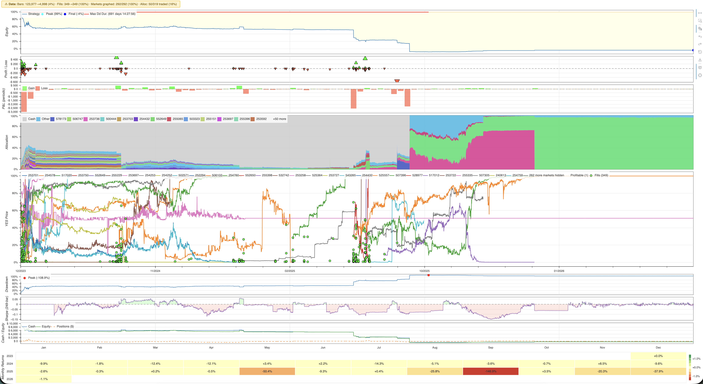
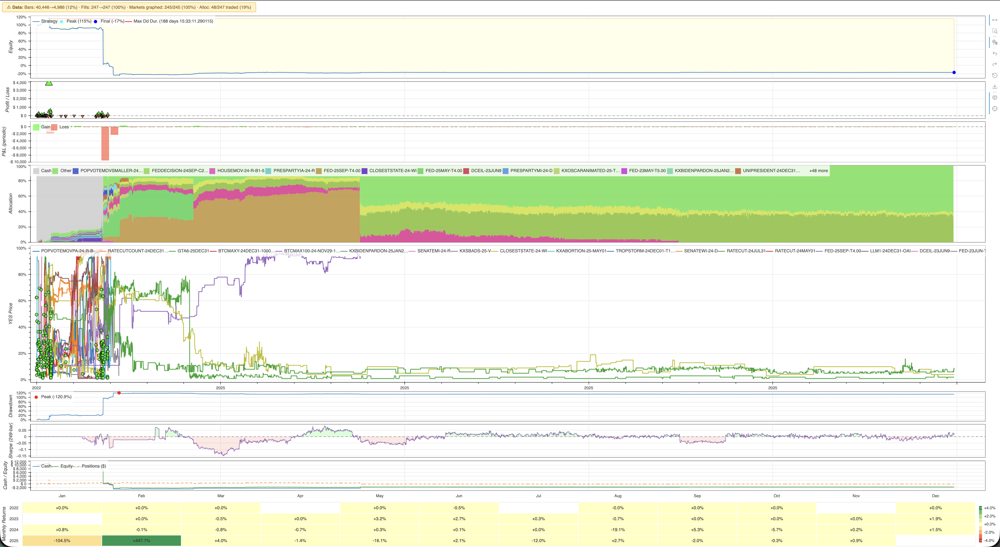

# prediction-market-backtesting

[](https://github.com/evan-kolberg/prediction-market-backtesting/actions/workflows/ci.yml)
[](https://www.python.org/downloads/)
[](https://www.rust-lang.org/)
[](LICENSE)
[](https://github.com/astral-sh/ruff)
[](https://github.com/astral-sh/uv)
[](https://duckdb.org)


An event-driven backtesting engine for prediction market trading strategies. Replays historical trades from [Kalshi](https://kalshi.com) and [Polymarket](https://polymarket.com) in chronological order, simulating order fills, portfolio tracking, and market lifecycle events. The hot loop (broker, portfolio, lifecycle) is compiled to native code via [PyO3](https://pyo3.rs) while strategy callbacks remain in Python. Inspired by [NautilusTrader](https://github.com/nautechsystems/nautilus_trader), plotting inspired by [minitrade](https://github.com/dodid/minitrade).

These two graphs below are the output of the gambling strategy. Losing money has never looked so good.



Built on top of [prediction-market-analysis](https://github.com/Jon-Becker/prediction-market-analysis) for data indexing and analysis.

## Roadmap

- [x] **Interactive charts** — Bokeh-based HTML charts with linked equity curve, P&L, market prices, drawdown, and cash panels
- [ ] **Slippage, latency, & liquidity modeling** — these will impact live-deployed strategies, so it's very important to backtest with this taken into account. In low liquidity markets, large orders will eat through the order book and it's important to be aware of this price impact.
- [x] **Front-testing** — paper trade strategies against live WebSocket data from Kalshi and Polymarket
- [ ] **Time span selection** — restrict backtests to a specific date range (e.g. `--start 2024-01-01 --end 2024-12-31`)
- [ ] **Market filtering** — filter by market type, category, or specific market IDs
- [ ] **Advanced order types** — market orders, stop-losses, take-profit, and time-in-force options
- [ ] **Multi-strategy comparison** — run multiple strategies side-by-side and generate comparative reports

## Current issues

- [ ] High memory usage (42 GB when loading top 1% volume Polymarket data). The bulk of memory comes from the data feed and plotting pipeline — further work needed on streaming/chunked processing.
- [ ] Live paper-trading with Polymarket & Kalshi has not yet been verified to work fully. It is a WIP.
- [ ] Liquidity modeling is still a huge issue. [Check this issue](https://github.com/evan-kolberg/prediction-market-backtesting/issues/1#issue-3950578019).

## Prerequisites

- Python 3.9+
- [uv](https://docs.astral.sh/uv/) — fast Python package manager `brew install uv`
- [zstd](https://github.com/facebook/zstd) — required for data decompression `brew install zstd`
- [GNU Make](https://www.gnu.org/software/make/) - needed for using makefiles `brew install make`
- [Rust](https://rustup.rs/) — required for the compiled engine `curl --proto '=https' --tlsv1.2 -sSf https://sh.rustup.rs | sh`

## Setup (created on macOS)
> It is still entirely possible to run this on Windows & Linux, but the terminal commands will look different. Until they are fully supported, I recommend you use something like Claude Code or GitHub Copilot to handle the initial setup on your system.

### 1. Clone the repository

```bash
git clone --recurse-submodules https://github.com/evan-kolberg/prediction-market-backtesting.git
cd prediction-market-backtesting
```

If you already cloned without `--recurse-submodules`:

```bash
git submodule update --init --recursive
```

### 2. Install dependencies

uv manages virtual environments automatically — no manual activation needed. Each project (root and submodule) has its own `pyproject.toml` and isolated environment. uv resolves and installs dependencies on first `uv run`.

```bash
uv sync
```

### 3. Build the engine

```bash
make build-rust
```

> **Note:** Requires a Rust toolchain ([rustup](https://rustup.rs/)) and [maturin](https://www.maturin.rs/) (`pip install maturin` or `uv pip install maturin`).

### 4. Download the data

This downloads and extracts the historical trade dataset (~36 GB compressed, ~53.57 uncompressed) into the submodule's `data/` directory. A symlink at the root points there.

```bash
make setup
```

> **Note:** This step installs `zstd` and `aria2c` if not already present (via Homebrew on macOS or apt on Linux), then downloads and extracts the dataset. You only need to do this once.

### 5. Run a backtest

```bash
make backtest
```

This launches an interactive menu where you select a strategy, platform, and market sample size. Results are printed to the terminal and an event log is saved to `output/`.


To run a specific strategy directly:

```bash
make backtest <strat_name>
```

### 6. Front test (live paper trading)

```bash
make fronttest
```

This connects to live WebSocket feeds from Kalshi or Polymarket and paper trades your strategy against real-time market data. No real money is used — fills are simulated using the same matching logic as the backtest engine.

You'll be prompted to select a strategy, platform, and market IDs to watch. Press Enter without providing an ID to auto-select a random active market.

To run a specific strategy directly:

```bash
make fronttest <strat_name>
```

**Kalshi** requires API credentials — set `KALSHI_API_KEY` and `KALSHI_PRIVATE_KEY_PATH` environment variables. **Polymarket** uses public WebSocket data and needs no authentication.

## Available Commands

| Command | Description |
|---|---|
| `make backtest [name]` | Run a backtest interactively or by strategy name |
| `make fronttest [name]` | Front test a strategy against live market data (paper trading) |
| `make build-rust` | Compile the engine |
| `make setup` | Initialize submodule and download trade data |
| `make test` | Run the test suite |
| `make lint` | Check code style with Ruff |
| `make format` | Auto-format code with Ruff |

Any target not defined in the root Makefile is forwarded to the [prediction-market-analysis](https://github.com/Jon-Becker/prediction-market-analysis) submodule:

| Command | Description |
|---|---|
| `make index` | Build/rebuild DuckDB indexes over the raw parquet data |
| `make analyze` | Run the full analysis suite and write results to `output/` |
| `make package` | Package analysis outputs for distribution |

## Writing a Strategy

Create a new file in `src/backtesting/strategies/` and subclass `Strategy`:

```python
from src.backtesting.models import TradeEvent
from src.backtesting.strategy import Strategy


class MyStrategy(Strategy):
    def __init__(self, initial_cash: float = 10_000.0):
        super().__init__(
            name="my_strategy",
            description="Description shown in the menu",
            initial_cash=initial_cash,
        )

    def on_trade(self, trade: TradeEvent) -> None:
        """Called for every historical trade event."""
        if trade.yes_price < 0.10:
            self.buy_yes(trade.market_id, price=0.10, quantity=10.0)
```

Strategies are auto-discovered — drop a `.py` file in the `strategies/` directory and it appears in the backtest menu.

### Strategy API

| Method | Description |
|---|---|
| `buy_yes(market_id, price, quantity)` | Place a limit buy on YES contracts |
| `buy_no(market_id, price, quantity)` | Place a limit buy on NO contracts |
| `sell_yes(market_id, price, quantity)` | Place a limit sell on YES contracts |
| `sell_no(market_id, price, quantity)` | Place a limit sell on NO contracts |
| `cancel_order(order_id)` | Cancel a pending order |
| `cancel_all(market_id=None)` | Cancel all pending orders |

### Lifecycle Hooks

| Hook | When it fires |
|---|---|
| `initialize()` | Once before the simulation starts |
| `on_trade(trade)` | Every historical trade event |
| `on_fill(fill)` | When one of your orders fills |
| `on_market_open(market)` | When a market's open time is reached |
| `on_market_close(market)` | When a market's close time is reached |
| `on_market_resolve(market, result)` | When a market resolves to YES or NO |
| `finalize()` | Once after the simulation ends |

### Properties

| Property | Description |
|---|---|
| `self.portfolio` | Current portfolio snapshot (cash, equity, positions) |
| `self.open_orders` | List of currently pending orders |
| `self.markets` | All available market metadata |

## Project Structure

```
├── main.py                          # CLI entry point
├── Makefile                         # build commands (proxies to submodule)
├── pyproject.toml                   # python dependencies
├── data -> prediction-market-analysis/data  # symlink to trade data
├── crates/
│   └── backtesting_engine/          # compiled rust core (PyO3)
│       ├── Cargo.toml
│       └── src/
│           ├── lib.rs               # PyO3 module definition
│           ├── engine.rs            # hot loop, event logging, FFI
│           ├── broker.rs            # order matching (HashMap by market_id)
│           ├── portfolio.rs         # position tracking, resolution, snapshots
│           └── models.rs            # internal rust data types
├── src/
│   └── backtesting/
│       ├── rust_engine.py           # python wrapper for the Rust core
│       ├── front_test_engine.py     # live paper-trading engine
│       ├── paper_broker.py          # pure-Python broker for paper trading
│       ├── strategy.py              # abstract strategy base class
│       ├── models.py                # data models (TradeEvent, Order, Fill, etc.)
│       ├── metrics.py               # performance metric calculations
│       ├── plotting.py              # interactive Bokeh charts
│       ├── logger.py                # event logging
│       ├── progress.py              # progress bar display
│       ├── _archive/                # pure-Python engine (fallback)
│       │   ├── engine.py
│       │   ├── broker.py
│       │   └── portfolio.py
│       ├── feeds/
│       │   ├── base.py              # abstract data feed interface
│       │   ├── kalshi.py            # kalshi parquet data feed
│       │   ├── kalshi_live.py       # live Kalshi eebSocket feed
│       │   ├── polymarket.py        # polymarket parquet data feed
│       │   └── polymarket_live.py   # live Polymarket eebSocket feed
│       └── strategies/              # auto-discovered strategy files
│           └── gambling_addiction.py# typical gambling tactics
├── tests/                           # test suite
├── output/                          # backtest logs and results
└── prediction-market-analysis/      # data & analysis submodule
```

## Data

Historical trade data is sourced from the [prediction-market-analysis](https://github.com/Jon-Becker/prediction-market-analysis) project. The dataset is stored as parquet files and queried via DuckDB.

| Platform | Data |
|---|---|
| Kalshi | Markets metadata + individual trades with prices in cents (1–99) |
| Polymarket | On-chain CTF Exchange trade executions (OrderFilled events from Polygon) joined with block timestamps. Not CLOB order book data — only filled trades are available. |

## License

This project is licensed under the MIT License. See [LICENSE](LICENSE) for details.

---

## Star History

[](https://www.star-history.com/#evan-kolberg/prediction-market-backtesting&type=date&legend=top-left)
